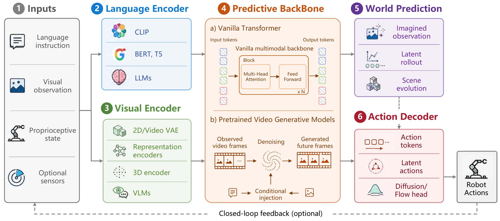
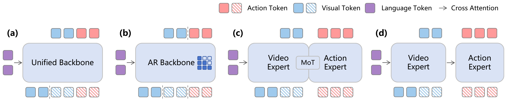

<!-- Generated by scripts/generate-readme.mjs. Update the source data or generator, then regenerate. -->
<div align="center">
  <h1>Awesome World Action Model</h1>
  <p>
    <a href="https://rcl-robotics.github.io/Awesome-World-Action-Model/"></a>
    
  </p>
  <p><strong>World-Action Models for Robot Learning and Control: A Survey</strong></p>
  <p>
    Zuxing&nbsp;Lu<sup>1,*</sup>, Hongjia&nbsp;Zhai<sup>1,*</sup>, Guanzhi&nbsp;Wang<sup>2</sup>, Huajian&nbsp;Zeng<sup>1</sup>,<br />
    Jiaqi&nbsp;Yang<sup>1</sup>, Jingyu&nbsp;Liu<sup>1</sup>, Lei&nbsp;Cheng<sup>1</sup>, Yuantai&nbsp;Zhang<sup>1</sup>,<br />
    Yuheng&nbsp;Qiu<sup>3</sup>, Zezhou&nbsp;Cheng<sup>4</sup>, Ivan&nbsp;Laptev<sup>1</sup>, Danfei&nbsp;Xu<sup>5</sup>,<br />
    Benjamin&nbsp;Riviere<sup>6</sup>, Giuseppe&nbsp;Loianno<sup>7</sup>, Eric&nbsp;Xing<sup>1</sup>, Xingxing&nbsp;Zuo<sup>1,†</sup>
  </p>
  <p>
    <sup>1</sup> MBZUAI &nbsp;·&nbsp; <sup>2</sup> Caltech &nbsp;·&nbsp; <sup>3</sup> Amazon FAR<br />
    <sup>4</sup> University of Virginia &nbsp;·&nbsp; <sup>5</sup> Georgia Tech<br />
    <sup>6</sup> New York University &nbsp;·&nbsp; <sup>7</sup> UC Berkeley
  </p>
  <p><sup>*</sup> Equal contribution &nbsp;·&nbsp; <sup>†</sup> Corresponding author</p>
</div>

## Our view of WAM

> **A World-Action Model (WAM) connects future-state modeling with executable action generation to support predictive robot control.**

World models learn how the environment evolves, often conditioned on actions; VLA policies map observations and language to actions. In our survey, WAMs connect these capabilities within a shared learning or inference process, so action generation is informed by predicted consequences.

### Predicting futures and actions

Let $`h_t = \mathbf{o}_{\lt t}`$ denote observation history and $`\ell`$ a task instruction. Over a horizon $`H`$, write $`\mathbf{O} = \mathbf{o}_{t:t+H}`$ for future observations and $`\mathbf{A} = \mathbf{a}_{t:t+H}`$ for the action chunk. The survey's unified view is:

```math
\left(\widehat{\mathbf{O}},\widehat{\mathbf{A}}\right)
= f_{\mathrm{WAM}}(h_t,\ell).
```

This is a functional view of the system: predictions and actions may be produced by a unified backbone or by connected modules. Predictive representations can encode visual appearance, latent dynamics, or 3D structure.

[](public/survey-assets/wam-components.pdf)

*Component view from our survey.* Language provides task conditioning, the visual encoder defines the predictive state, the backbone models dynamics, and the action decoder produces executable controls. [Open the full-size figure](public/survey-assets/wam-components.pdf).

### Two routes from prediction to action

**Joint prediction** models future observations and actions together, coupling world prediction and policy generation:

```math
p_{\mathrm{joint}}(\mathbf{O},\mathbf{A}\mid h_t,\ell).
```

**Inverse dynamics (IDM)** follows a plan-then-act factorization: predict a future, then infer actions that connect the current context to that future:

```math
\underbrace{p_{\mathrm{plan}}(\mathbf{O}\mid h_t,\ell)}_{\text{predict a future}}
\;\underbrace{p_{\mathrm{IDM}}(\mathbf{A}\mid h_t,\mathbf{O})}_{\text{infer executable actions}}.
```

These prediction routes form a separate axis from architecture: either can use **One Model** with a shared backbone or a **Dual-system** design with distinct world and action experts. Joint training alone does not determine the architecture. Some IDM-style systems learn this interface implicitly and decode actions without explicitly generating a full future rollout at inference.

[](public/survey-assets/wam-architectures.pdf)

*Architecture taxonomy from our survey.* (a) One Model + joint prediction; (b) One Model + IDM; (c) Dual-system + joint prediction; (d) Dual-system + IDM. [Browse these four families](#architecture-index) · [Open the full-size figure](public/survey-assets/wam-architectures.pdf).

### What makes a predicted world useful?

Our central criterion is **control utility**. Visual fidelity and prediction accuracy should be evaluated alongside task success, robustness, and deployment cost. The survey highlights four requirements:

- **Action grounding:** connect predicted changes to controls the robot can execute.
- **Spatial and temporal consistency:** preserve geometry, object permanence, and coherent evolution.
- **Closed-loop improvement:** use interaction and failure feedback to improve behavior.
- **Real-time control:** keep prediction and action decoding within the feedback budget.

The collection covers complete WAM systems alongside foundations, VLA policies, reusable components, datasets, and evaluation resources. [Explore the category index ↓](#major-categories)

## Navigation

- [Browse by major category](#major-categories)
- [Compare the four architecture families](#architecture-index)
- [Find repository resources](#repository-guide)
- [Citation](#citation)
- [Star history](#star-history)

[Project website](https://rcl-robotics.github.io/Awesome-World-Action-Model/) · [Full paper catalog](docs/PAPERS.md) · [Reading reports](https://rcl-robotics.github.io/Awesome-World-Action-Model/reports/)

**564 entries · 7 major categories** · Catalog updated 2026-09-11

## Major categories

Click a category to jump to its paper list in this repository. Use **Browse** to search and filter the same category on the website.

| Category | What you will find | Entries | Interactive view |
| --- | --- | ---: | --- |
| [Foundational work](docs/PAPERS.md#major-foundational-work) | World models, model-based RL, planning, theory, and surveys | 59 | [Browse](<https://rcl-robotics.github.io/Awesome-World-Action-Model/?major=%E5%A5%A0%E5%9F%BA%E6%80%A7%E5%B7%A5%E4%BD%9C#library>) |
| [VLA](docs/PAPERS.md#major-vla) | Vision-language-action policies and their learning methods | 35 | [Browse](<https://rcl-robotics.github.io/Awesome-World-Action-Model/?major=VLA#library>) |
| [WAM](docs/PAPERS.md#major-wam) | Models connecting world prediction with action generation and control | 227 | [Browse](<https://rcl-robotics.github.io/Awesome-World-Action-Model/?major=WAM#library>) |
| [Datasets](docs/PAPERS.md#major-datasets) | Robot demonstrations, interaction data, video, and multimodal resources | 32 | [Browse](<https://rcl-robotics.github.io/Awesome-World-Action-Model/?major=%E6%95%B0%E6%8D%AE%E9%9B%86#library>) |
| [Evaluation metrics](docs/PAPERS.md#major-evaluation-metrics) | Prediction quality, action consistency, and control performance | 14 | [Browse](<https://rcl-robotics.github.io/Awesome-World-Action-Model/?major=%E8%AF%84%E4%BC%B0%E6%8C%87%E6%A0%87%EF%BC%88Metrics%EF%BC%89#library>) |
| [Benchmarks &amp; simulators](docs/PAPERS.md#major-benchmarks-simulators) | Evaluation tasks, environments, and simulation platforms | 32 | [Browse](<https://rcl-robotics.github.io/Awesome-World-Action-Model/?major=%E8%AF%84%E6%B5%8B%E5%9F%BA%E5%87%86%E4%B8%8E%E6%A8%A1%E6%8B%9F%E5%99%A8#library>) |
| [WAM Components](docs/PAPERS.md#major-wam-components) | Encoders, predictive backbones, action interfaces, and training methods | 80 | [Browse](<https://rcl-robotics.github.io/Awesome-World-Action-Model/?major=WAM%20Components#library>) |
| [Major category not recorded](docs/PAPERS.md#major-not-recorded) | Entries awaiting a recorded major category | 85 | [Browse](<https://rcl-robotics.github.io/Awesome-World-Action-Model/?major=__unassigned__#library>) |

## Architecture index

We compare two design choices: **One Model or Dual-system** architecture, and **joint prediction or inverse dynamics (IDM)** for connecting worlds and actions. Click a quadrant to browse its entries.

| Architecture | Joint prediction | Inverse dynamics (IDM) |
| --- | --- | --- |
| One Model | [Q1](<https://rcl-robotics.github.io/Awesome-World-Action-Model/?quadrant=Q1%20%C2%B7%20One%20Model%20%C3%97%20%E8%81%94%E5%90%88%E9%A2%84%E6%B5%8B#library>) · 38 entries | [Q2](<https://rcl-robotics.github.io/Awesome-World-Action-Model/?quadrant=Q2%20%C2%B7%20One%20Model%20%C3%97%20IDM#library>) · 9 entries |
| Dual-system | [Q3](<https://rcl-robotics.github.io/Awesome-World-Action-Model/?quadrant=Q3%20%C2%B7%20Dual-system%20%C3%97%20%E8%81%94%E5%90%88%E9%A2%84%E6%B5%8B#library>) · 27 entries | [Q4](<https://rcl-robotics.github.io/Awesome-World-Action-Model/?quadrant=Q4%20%C2%B7%20Dual-system%20%C3%97%20IDM#library>) · 54 entries |

Joint training alone does not establish a One Model architecture. [Other classification states](docs/PAPERS.md#classification-summary) retain entries outside the four quadrants, entries for which the taxonomy does not apply, and cases awaiting verification.

## Repository guide

| Resource | Where to go |
| --- | --- |
| Complete paper lists and source links | [Paper catalog](docs/PAPERS.md) |
| Thematic browsing | [Research topics](docs/PAPERS.md#research-topics) |
| Visual category and architecture maps | [Research map](https://rcl-robotics.github.io/Awesome-World-Action-Model/map/) |
| Detailed paper analyses | [Reading reports](https://rcl-robotics.github.io/Awesome-World-Action-Model/reports/) |
| Machine-readable bibliography | [papers.json](data/papers.json) |
| Setup, catalog updates, and contribution workflow | [Maintainer guide](docs/MAINTAINING.md) |
| Recommend a paper or report a correction | [Open an issue](https://github.com/RCL-Robotics/Awesome-World-Action-Model/issues/new/choose) |
| Repository code license | [MIT License](LICENSE) |

Paper abstracts and other attributed research content remain the work of their respective authors and rights holders.

## Citation

<!-- Citation placeholder: add the verified paper reference and BibTeX here when available. -->
*Citation details and BibTeX will be added here when available.*

## Star History

The chart tracks this repository's GitHub stars over time and fills in as stars are recorded.

<a href="https://www.star-history.com/?repos=RCL-Robotics%2FAwesome-World-Action-Model&amp;type=date&amp;legend=top-left">
  <picture>
    <source media="(prefers-color-scheme: dark)" srcset="https://api.star-history.com/chart?repos=RCL-Robotics/Awesome-World-Action-Model&amp;type=date&amp;legend=top-left&amp;theme=dark" />
    <source media="(prefers-color-scheme: light)" srcset="https://api.star-history.com/chart?repos=RCL-Robotics/Awesome-World-Action-Model&amp;type=date&amp;legend=top-left" />
    
  </picture>
</a>
